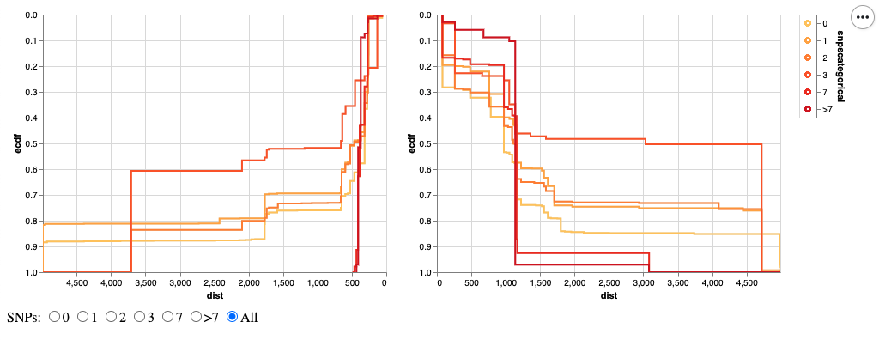
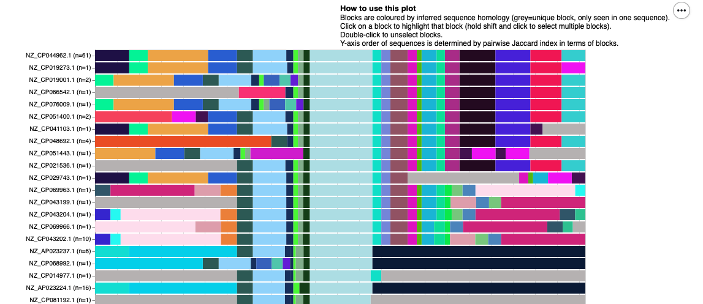

# Analysing the evolution of gene flanking regions

__Liam P. Shaw__

Repository of scripts and data for analysis of the genomic contexts of a given focal gene - presents a pipeline to analyse the surrounding regions of genes using [pangraph](https://github.com/neherlab/pangraph) and generate output plots. The original intention was to analyse beta-lactamase genes, but the pipeline is now generalised for any input gene. 






### Repository structure

The pipeline uses [snakemake](https://snakemake.readthedocs.io/en/stable/index.html). 

Dependencies can be installed with conda or mamba (recommended: mamba):

```
mamba env create -f bl-region-env.yaml
conda activate bl-region-env
```

The full snakemake pipeline can be run on the example data with the following command:

```
snakemake --cores 1 \
          --configfile configs/default_config.yaml \
          -r prepare_DB run_pangraph calculate_distances make_plots
```

Equivalently you can call the full pipeline with:

```
python run_full_pipepine.py --config-file configs/default_config.yaml
```

Outputs for a given gene are saved in `{output_prefix}/{focal_gene}` and include output data files as well as pdf plots (generated with R) and html plots (generated with [altair](https://altair-viz.github.io/) in Python).


## Configuration file 

All parameters are passed in with a configuration file - for an example, see `configs/default_config.yaml`.


For each focal gene, there are two expected input files:

* `input/focal_genes/{gene}.fa` - the focal gene of interest 
* `input/focal_genes/{gene}_contigs.fa` - multi-fasta with the contigs which have been identified as containing the focal gene 

A small dataset (n=34 sequences) is provided for the *mcr-1.1* gene with 5kb flanking regions in the `input` directory. Parameters for the analysis can be specified in the config file. For example, `configs/default_config.yaml`:

```
version: "default"
    # historic use (whether using on slurm cluster or not)
focal_genes : ["mcr-1.1"]
    # list of focal genes to run pipeline on 
    # assumes existence of 
    #   input/focal_genes/mcr-1.1.fa 
    #   input/contigs/mcr-1.1fa
complete: True 
    # False (incomplete contigs) is a work-in-progress - do not use!
panx_export : False
    # whether to export pangraph output to panX (time-intensive)
bandage : True
    # whether to plot pangraph with Bandage
snv_threshold : "25"
    # how many single nucleotide variants to allow in the focal gene
    # for a contig to be included in the pangraph
region_upstream : "5000"
    # size of upstream flanking region (bases)
region_downstream : "5000"
    # size of downstream flanking region (bases)
pangraph_polish : False
    # whether to 'polish' pangraph by realigning block sequences
pangraph_aligner : "minimap2"
    # alignment kernel for pangraph. other option: mmseqs (slower, more sensitive/accurate for divergent sequences)
pangraph_seed : 0 
    # random seed for pangraph
pangraph_alpha : 100 
    # alpha parameter, controls cost of splitting blocks
pangraph_beta : 10 
    # beta parameter, controls cost of block diversity
pangraph_minblocklength : "100" 
    # minimum length of blocks - changing can have large effects on the pangraph
pangraph_edgeminlength : "0"
    # minimum edge length in graph for exporting to gfa
DB: ["CARD"] 
    # Existing database data/CARD_db.fa of known gene variants
include_gff: False
    # whether to include gff annotations - assumed in gffs/mcr-1.1_annotations.gff
output_prefix : "output"
    # output folder
```


A more detailed tutorial on how to prepare data and use the pipeline is available in `tutorial/Tutorial.md`.
