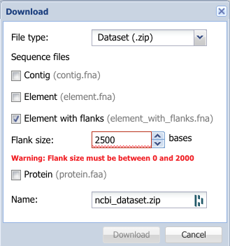

# Tutorial on pipeline

This document aims to give a basic tutorial in how to use the pipeline to explore the neighbourhood of a particular gene. 

## Obtaining your input files

The first thing you need to do is obtain two input files: a fasta file containing a focal gene of interest (`gene.fa`), and a set of contigs that contain the gene (`gene_contigs.fa`). 

You may already have these prepared for your own dataset. Alternatively, you may be interested in downloading some existing fasta files from NCBI. 

For those interested in antimicrobial resistance (AMR) genes. 

The NCBI Pathogen Detection Microbial Browser for Identification of Genetic and Genomic Elements ([MicroBIGGE](https://www.ncbi.nlm.nih.gov/pathogens/microbigge/)) offers an interface to search for contigs containing a gene. 

For example, we can search for mcr-1.1:

Currently (25 May 2023) there is only an option to download whole contigs for up to 1,000 hits. Shown here are the results of the search: `mcr-1.1 AND "salmonella enterica subsp. enterica"`.

If there are more than 1,000 hits you have the option to download the gene hits with up to 2,000 bases flanking them in either direction (shorter contigs will return the whole contig). Trying to download more will give you an error:

