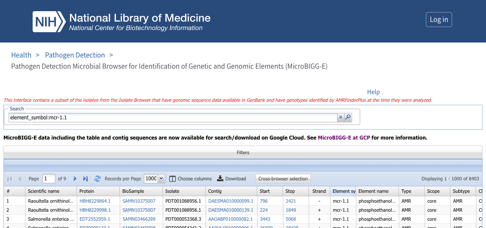
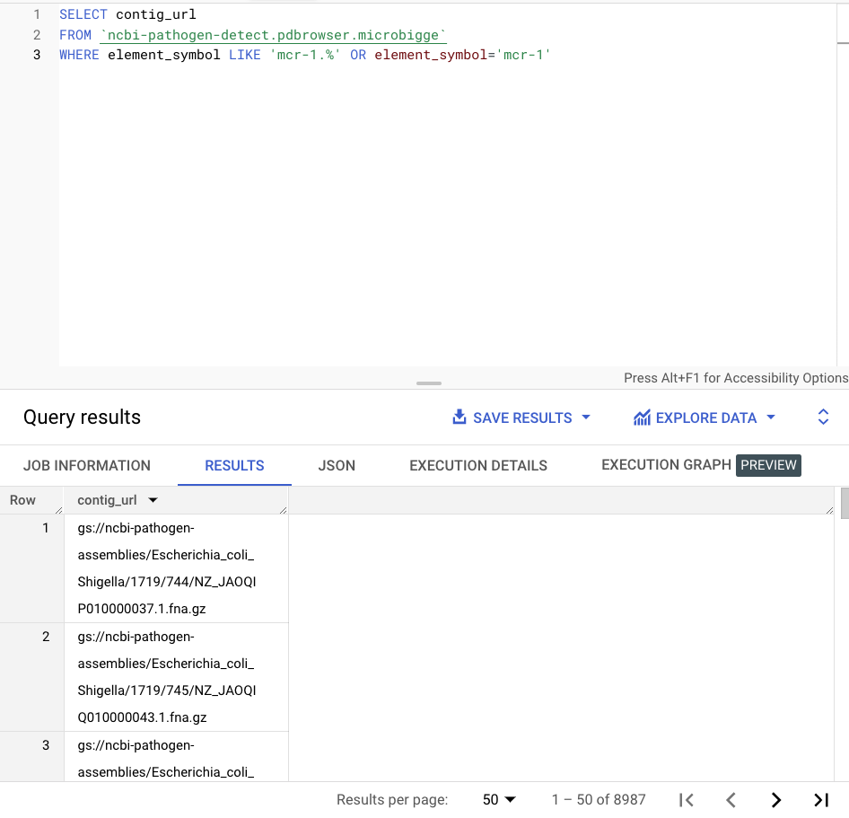

# Tutorial on pipeline

This document aims to give a detailed explanation of how to use the pipeline to explore the neighbourhood of a particular gene. 

## Obtaining your input files

The first thing you need to do is obtain two input files: a fasta file containing a focal gene of interest (`{gene}.fa`), and a set of contigs that contain the gene (`{gene}_contigs.fa`). 

You may already have these prepared for your own dataset. Alternatively, you may be interested in downloading some existing fasta files from NCBI. 


### Using NCBI to download AMR genes

For those interested in antimicrobial resistance (AMR) genes, let us assume that you have a particular resistance gene you are interested in and want to look at the region around that gene in published assemblies. 

#### MicroBIGGE

The NCBI Pathogen Detection Microbial Browser for Identification of Genetic and Genomic Elements ([MicroBIGGE](https://www.ncbi.nlm.nih.gov/pathogens/microbigge/)) offers an interface to search for contigs containing a gene. 

For example, we can search for all contigs that contain *mcr-1.1* (a variant of the *mcr-1* mobilised colistin resistance gene) using the search `element_symbol:mcr-1.1`:




**A note on searching for gene variants:** unfortunately the naming schemes for AMR genes can make this kind of Boolean search difficult. Taking *mcr-1* as an example, its variants are named as *mcr-1.1*, *mcr-1.2* etc. These are all almost identical with only a few SNPs separating them. You might want to include in a search using `element_symbol:mcr-1.*`. However, some hits will be to sequences that do not match a named variant, so will just be stored as *mcr-1*, which will not be matched by this search. But `element_symbol:mcr-1*` is not what you want either, because this would also return *mcr-10* - which is non-homologous to *mcr-1* (50.9% protein similarity). In conclusion, the right search to return all *mcr-1* variants but exclude other *mcr* genes is: `element_symbol:mcr-1.* OR element_symbol:mcr-1` (8987 hits as of 25 May 2023).


Currently (25 May 2023) there is only an option to download whole contigs for up to 1,000 hits. For *mcr-1.1* there are 8403 hits, so we cannot download all contigs from this interface. 

Options for download are: 

* download the table of hits and download the contigs using the `Contig` accessions (e.g. with [ncbi-acc-download](https://github.com/kblin/ncbi-acc-download). 
* download the gene hits with up to 2,000 bases flanking them in either direction (shorter contigs will return the whole contig)

The nice thing about MicroBIGGE is that you get access to the species information and some other metadata such as BioSample, which you can use to fetch other metadata. 

#### MicroBIGGE on Google Cloud Platform

An alternative way to search NCBI and download whole contigs is via the Google Cloud Platform. NCBI have a [guide](https://www.ncbi.nlm.nih.gov/pathogens/docs/microbigge_gcp/) on how to do this. 

First, we use an SQL query to obtain a list of Google Cloud storage locations of gzipped contigs:

```
SELECT contig_url
FROM `ncbi-pathogen-detect.pdbrowser.microbigge`
WHERE element_symbol LIKE 'mcr-1.%' OR element_symbol='mcr-1'
```

(returns 8987 hits as of 25 May 2023 i.e. matches MicroBIGGE)



We can download that list of locations as a csv (save as `locations.csv`):


Then, having [installed](https://cloud.google.com/storage/docs/gsutil_install) `gsutil` which allows download of Cloud Storage locations from the command line, we can download the contigs:

```
while read f;
do
	gsutil cp $f .
done < locations.csv
``` 

These contigs should then be combined into a single multi-fasta contig file for the pipeline (`gene_contigs.fa`).

Alternatively, you can just use `SELECT contig_acc` to get the accessions and use `ncbi-acc-download`.


## Preparing the pipeline

Your two files should be put in the following places (from the main directory):

* `input/focal_genes/{focal_gene}.fa`
* `input/focal_genes/{focal_gene_search}_contigs.fa`

You will need to edit the `Snakefile` as follows:

```
FOCAL_GENE_DICT = {"{focal_gene}":"{focal_gene_search}"} 
```

for example:

```
FOCAL_GENE_DICT = {"mcr-1.1": "mcr-1"} 
```

means the pipeline will assume that the following files exist:

* `input/focal_genes/mcr-1.1.fa`
* `input/focal_genes/mcr1_contigs.fa`

The snakemake pipeline is split up into different rules. You can run the full pipeline with:

```
snakemake --cores 1 --configfile configs/default_config.yaml -r run_pangraph calculate_distances make_plots
```

Various other options can be specific in the config file e.g. `configs/laptop_config.yaml`


```
version: "default"
panx_export : False
bandage : True
snp_threshold : "25"
region_upstream : "5000"
region_downstream : "5000"
pangraph_polish : False
pangraph_aligner : "minimap2"
pangraph_minblocklength : "100"
pangraph_edgeminlength : "0"
DB: ["CARD"] # Can include "NCBI" if desired, but very similar results
include_gff: False
```

### Optional: providing GFF files

The pipeline runs without annotation files by default, because pangraph uses only sequence similarity and no annotation information. However, it can be useful and interesting to see how the pangraph blocks correspond to the annotation information. Only `CDS` features will be used. 

If you have your own annotation files then they should be provided as a single gff. 

If you want to use NCBI annotation files, then you can get them with e.g. `ncbi-acc-download -F gff3 {accession}`. These can then be combined into a single gff (`cat *.gff > all.gff`; no need to strip out the headers etc., the pipeline can take care of it).

If you want gff annotations on top of the linear blocks, change `include_gff` to `True` in the config file and put a gff in `input/gffs/{gene}_annotations.gff`.

## Outputs

All outputs are put into 


## Beta-lactamase gene data

*To include:*  is a focus on beta-lactamase genes as an example: for the beta-lactamases, using CARD prevalence data, we obtain sequences containing twelve beta-lactamases from clinically important beta-lactamase families. 
*To include:* list of available accessions for download for each gene and their other metadata. 


